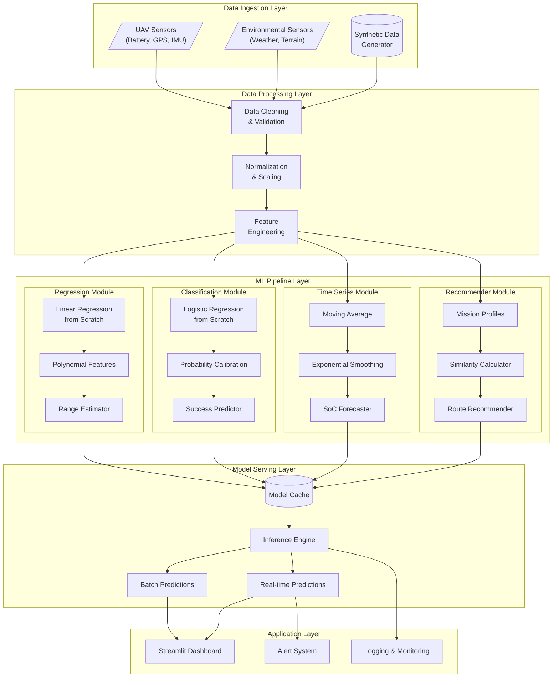
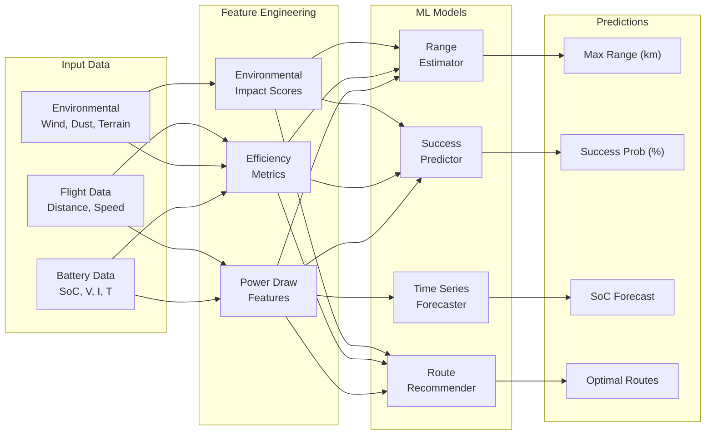
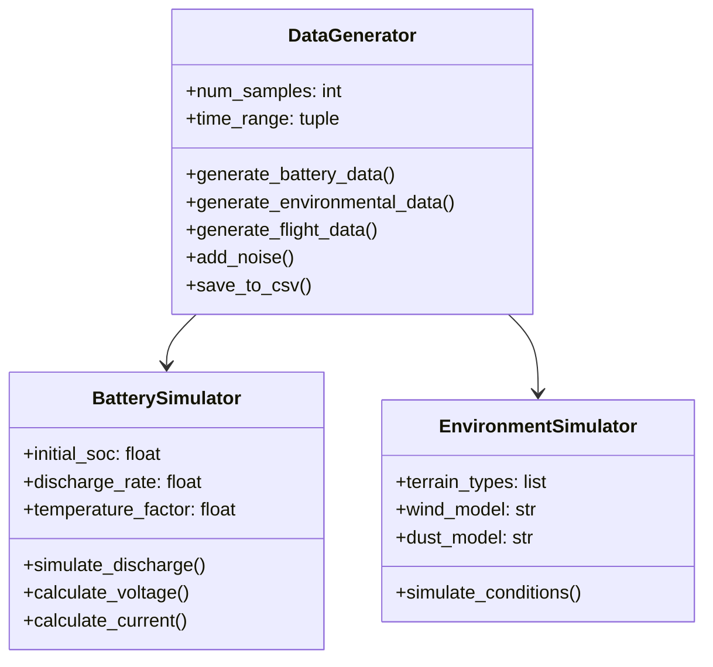
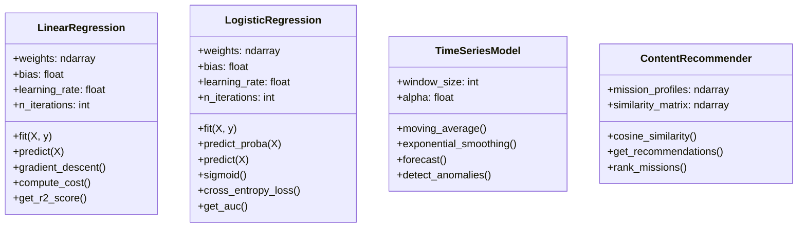
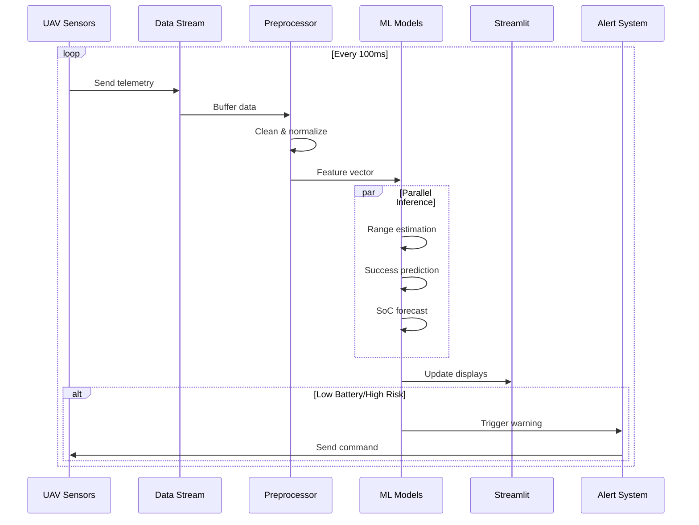
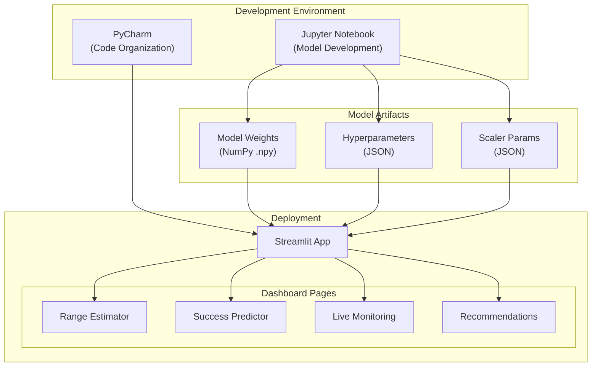
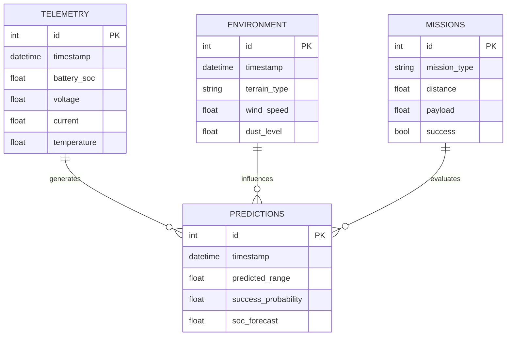
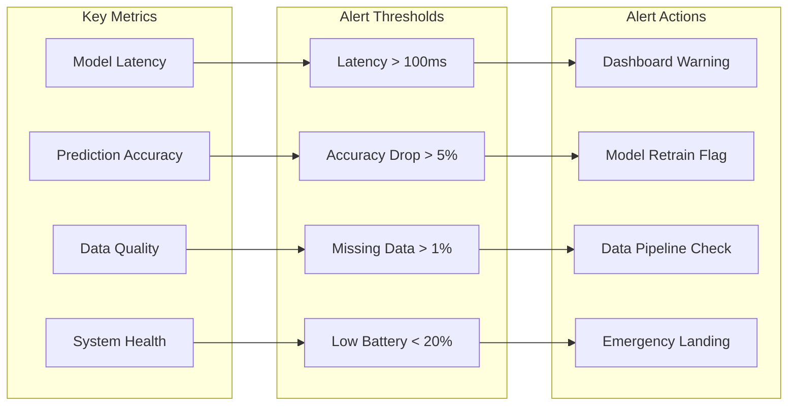

# System Design Document

## Predictive Range Monitoring System for UAVs

### 1. High-Level Architecture

---

### 2. Data Flow Diagram

---

### 3. Component Details

#### 3.1 Data Generation Module

#### 3.2 ML Models (From Scratch)

---

### 4. Real-Time Pipeline

---

### 5. Deployment Architecture

---

### 6. Database Schema (For Logging)

---

### 7. Monitoring & Alerting

---

### 8. Technology Stack

| Layer | Technology | Purpose |
|-------|-----------|---------|
| Data Processing | NumPy, Pandas | Data manipulation |
| ML Development | NumPy (from scratch) | Custom implementations |
| Visualization | Matplotlib, Seaborn | Charts & plots |
| Dashboard | Streamlit | Interactive UI |
| Development | Jupyter, PyCharm | Coding environments |
| Version Control | Git, GitHub | Source control |

---

### 9. Design Principles (Zinkevich's Rules)

| Principle | Implementation |
|-----------|----------------|
| **Rule #4**: Simple first model | Linear Regression baseline |
| **Rule #5**: Test infrastructure | Separate pipeline tests |
| **Rule #14**: Interpretable models | No black-box models initially |
| **Rule #29**: Train like serve | Same preprocessing code |
| **Rule #32**: Reuse code | Shared utility modules |
| **Rule #37**: Measure skew | Training/serving comparison |
